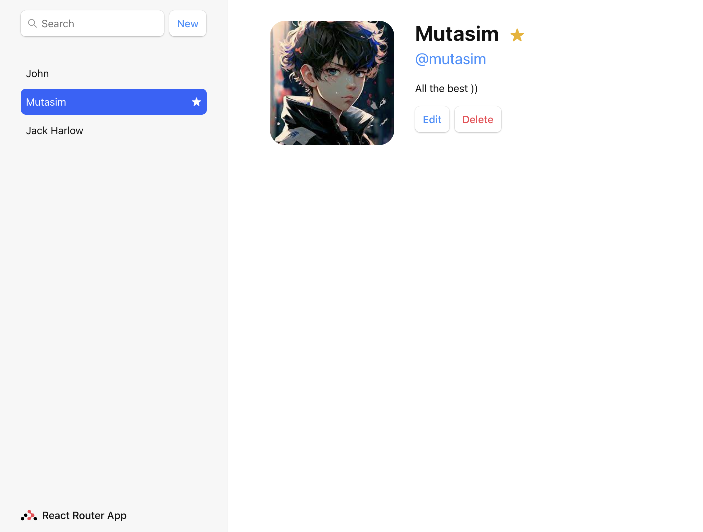
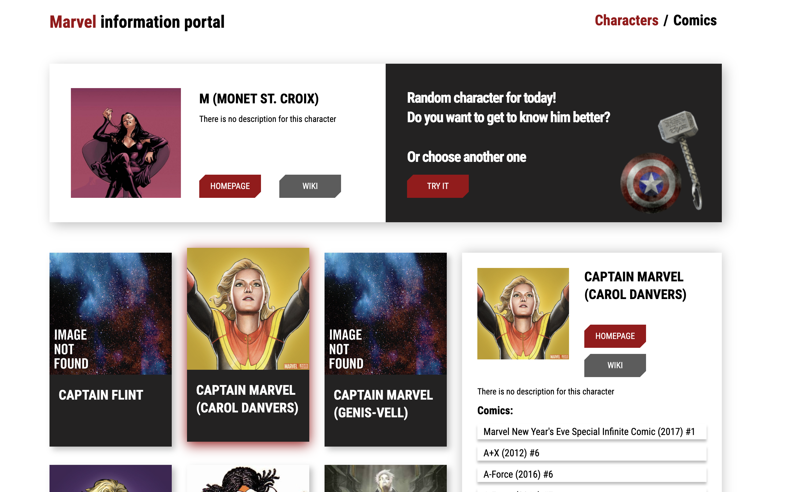
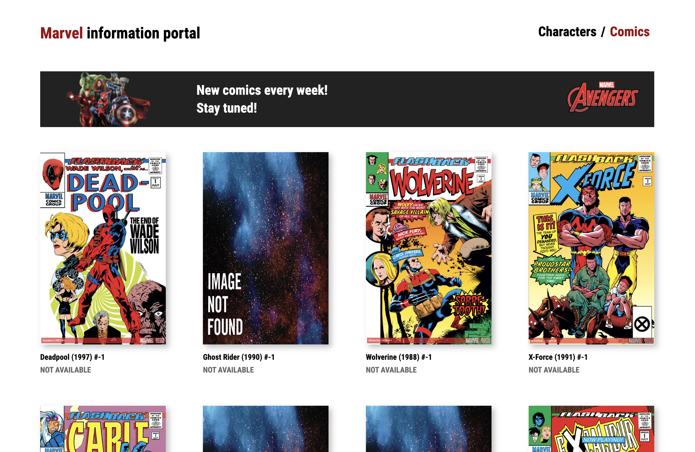
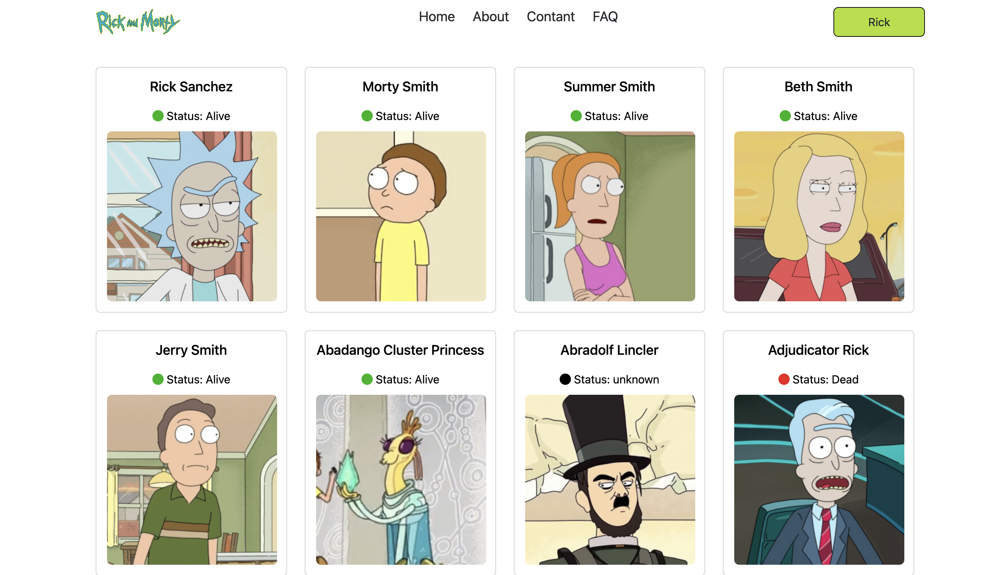
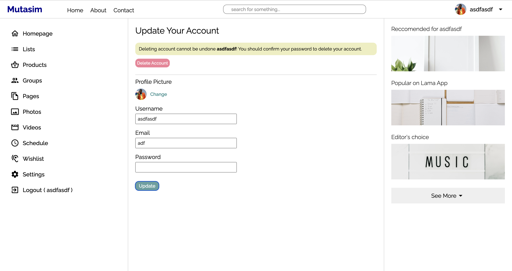
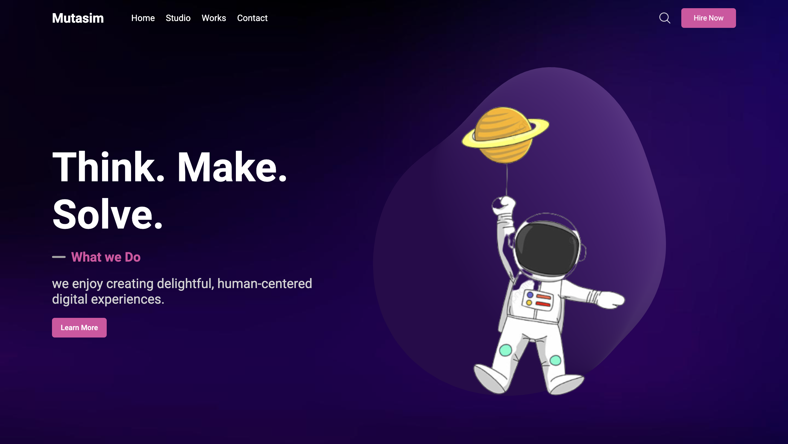
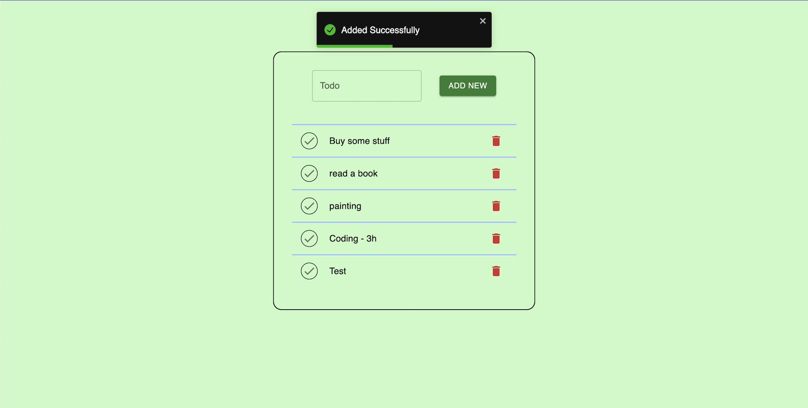
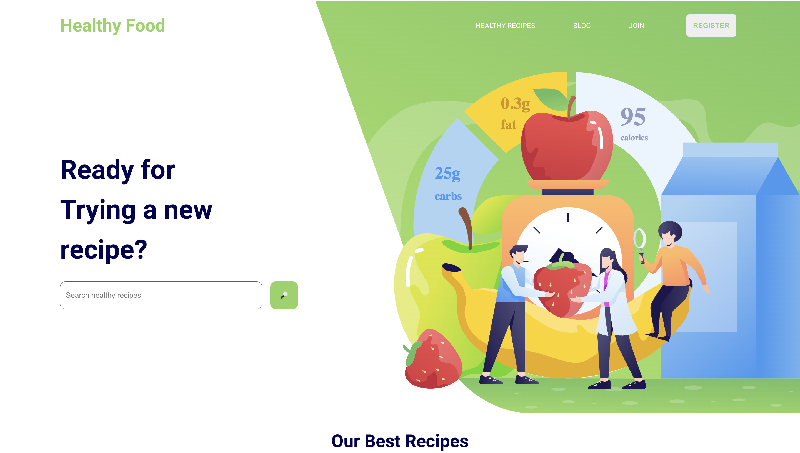

# ReactJS-Projects🪐

Welcome👋  to my ReactJS-Projects repository! Here, you'll find a collection of my various React projects that I've been working on. 🤓 As a developer, I believe that practical experience is the key 🔑 to mastering any technology, and this is why I've created this repository as a personal playground 🎮 to practice and refine my skills in React.🪐

As you may already know, React is a powerful ⚡ and popular 🌟 JavaScript library that is widely used for building user interfaces.🖼 It has become an essential 🔧 tool for web developers, and its popularity continues to grow day by day. As such, learning React is a valuable 💎 skill for any developer who wants to stay ahead in the industry.📌

In this repository, you will find mini projects that I've created using React.🪐 These projects are designed to showcase various features and functionalities of React, and they are a great resource 💡 for anyone who wants to start learning React or for those who want to practice and improve their skills.🖇

So, feel free to explore the projects in this repository 👀, star ⭐ the repository if you find it useful, and don't hesitate to ask me any questions ❓. I'm always happy 😊 to help! 

### Demo of projects :

- <a href="https://github.com/mutasim77/ReactJS-Projects/tree/main/currency-converter">Currency Converter</a>

- <a href="https://github.com/mutasim77/ReactJS-Projects/tree/main/react-router-app">React Router v6</a>

- <a href="https://github.com/mutasim77/TranslateWave">Translate Wave</a>

- <a href="https://github.com/mutasim77/ImagiNet">ImagiNet</a>

- <a href="https://github.com/mutasim77/react-admin-dashboard">React Admin Dashboard</a>

- <a href="https://github.com/mutasim77/Birth-to-Death">Life checklist</a>

- <a href="https://github.com/mutasim77/ReactJS-Projects/tree/main/employees">Employees</a>

- <a href="https://github.com/mutasim77/ReactJS-Projects/tree/main/bank_modern_app">Bank App</a>

- <a href="https://github.com/mutasim77/ReactJS-Projects/tree/main/marvel-app-api">Marvel App</a>

  
  

- <a href="https://github.com/mutasim77/ReactJS-Projects/tree/main/practice-class-component/rick-morty">Rick & Morty</a>

- <a href="https://github.com/mutasim77/ReactJS-Projects/tree/main/thinking-in-RToolkit">Thinking in RTK</a>

- <a href="https://github.com/mutasim77/ReactJS-Projects/tree/main/threejs-react-app">ThreeJS React App</a>

- <a href="https://github.com/mutasim77/ReactJS-Projects/tree/main/todo-rtk-query">TodoAPP - RTK Query</a>

- <a href="https://github.com/mutasim77/ReactJS-Projects/tree/main/healthy-food-landing">Healthy-Food Landing Page</a>

